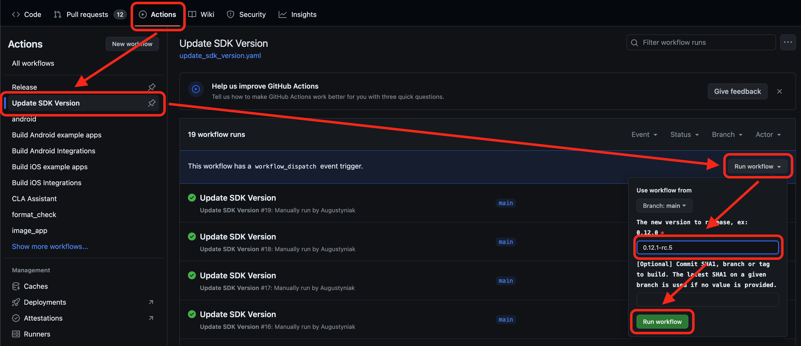

# Releasing

This document explains the process of releasing new versions of Bitdrift SDK.

## Release process

1. Go to `Actions` tab in GitHub Interface.
1. Select `Update SKD Version` action from the side menu on the left.
1. Hit `Run Workflow` button on the right.
1. Keep `main` branch selection, enter version that follows formatting rules from [Version Formatting](#version-formatting).
1. The CI job should open a PR named 'Update SDK version to 0.12.1-rc.4' ([example](https://github.com/bitdriftlabs/capture-sdk/pull/1637)).
1. Approve the PR, wait for the PR to be merged.
1. Look for `Release on SDK version change / Check for version change (push)` CI job started for the merge commit ([example](https://github.com/bitdriftlabs/capture-sdk/actions/runs/10206791724/job/28240351848)). Click `Details` to see how it progresses and approve public releases as needed.



An example release can be found [here](https://github.com/bitdriftlabs/capture-sdk/releases/tag/v0.12.1-rc.5).

## Version Formatting

Public bitdrift SDK versions should follow the following format:

```
0.{x}.{y}(-rc.{z})?
```

Example 0.1.0.

Please note that while officially our releases follow `0.x.y` format GitHub Releases use their "v" prefixed version (i.e., `v0.x.y`). That's because some tooling
expects this to differentiate other git tags from versioned releases.

Examples of correctly formatted versions:

* 0.1.0
* 0.1.12
* 0.1.12-rc.1

Examples of incorrectly formatted versions:

* v0.1.0
* v0.1.1.0
* 0.1.12-rc.0
* 0.1.12test

### Release Candidates

For increased development velocity and higher quality of stable SDK releases, we allow for the release of RC ("release candidate") versions of the SDK.

The way it works is that for small iterative changes to the SDK (changes we don't want to communicate to our customers as they are too small or not ready) or changes that we want to test more thoroughly before releasing them to a wider audience, we release `0.x.y-rcx` versions of the SDK. Such releases should not be automatically picked up by dependency managers, but their existence will allow us to integrate, test, and monitor them in Lyft apps.

Multiple release candidates can be released for a given SDK version, for example, `0.1.3-rc.1`, followed by `0.1.3-rc.2`, and so on. Once we reach a point where we want to share a given version with a wider audience, we cut a stable release, for instance, `0.1.3`.

### Test Releases

For increased developer velocity, the regex that CI uses to verify versions is more permissive compared to what we recommend the version string to look like for public releases. For example, a version such as `0.1.3-test.1` is allowed.
