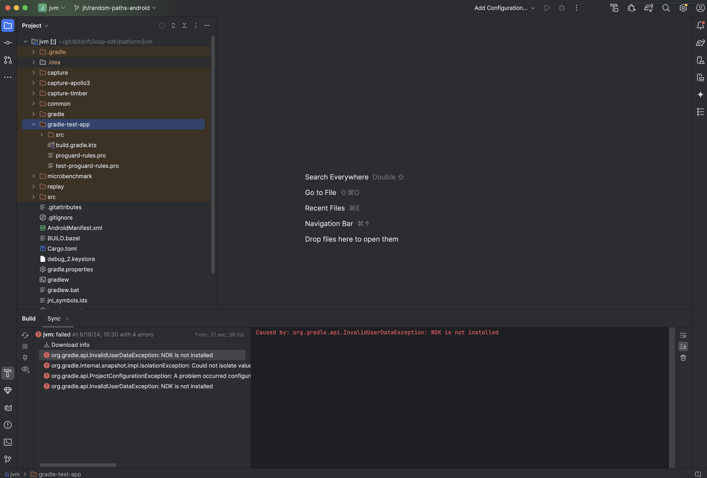
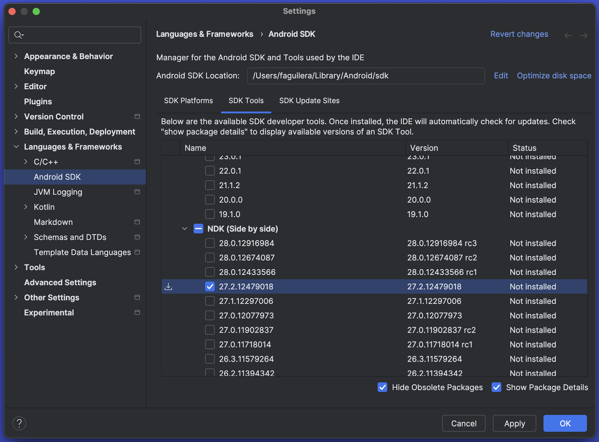
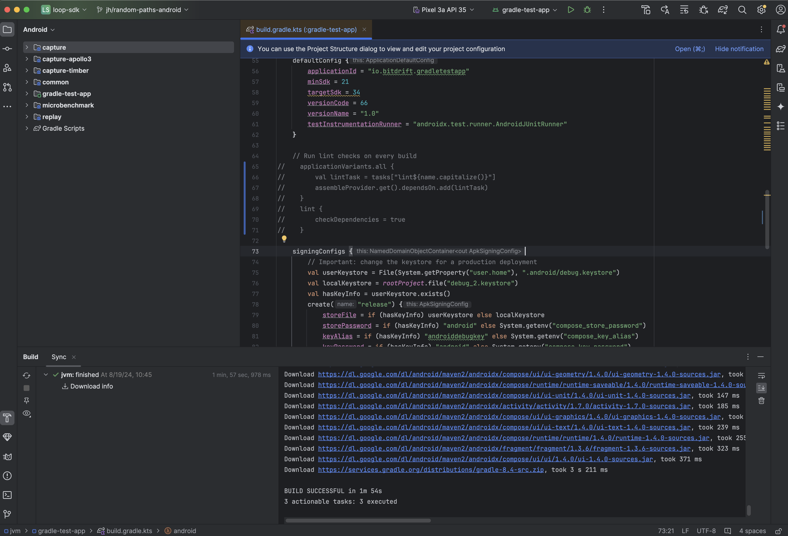
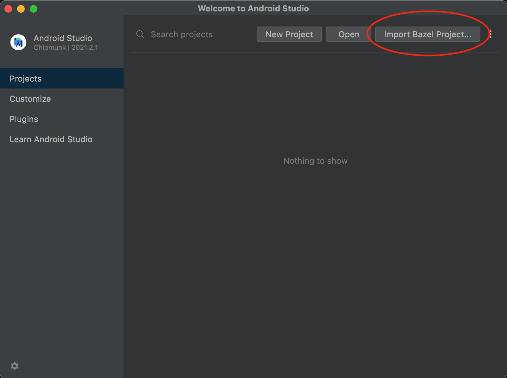
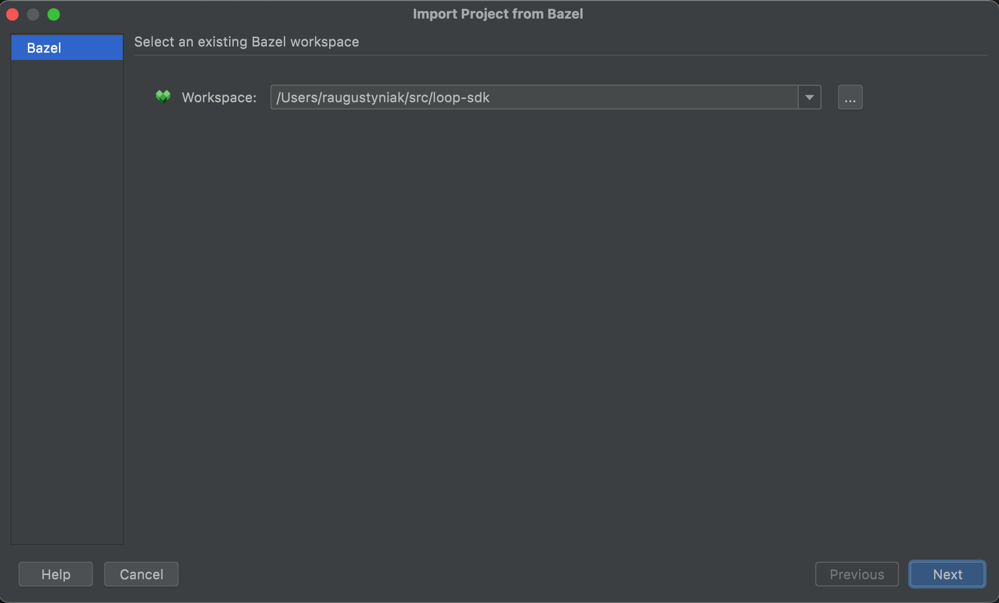
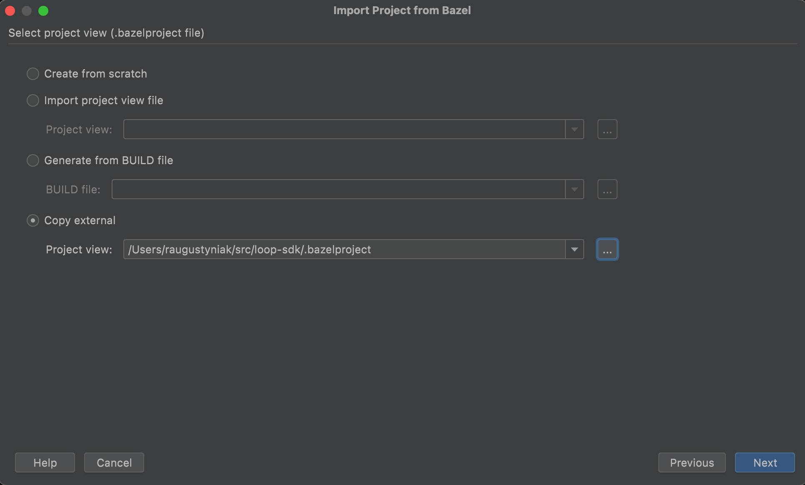
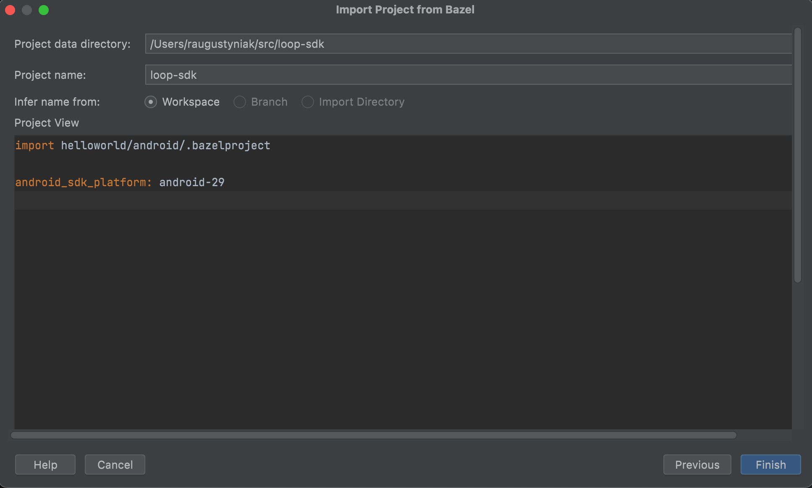

# Local Dev Setup

## iOS

### Running example apps on a device

1. Go to https://developer.apple.com/account and log in using your Bitdrift Apple ID.
1. Use Apple developer portal to add your device (using your device's UUID) to the list of known devices.
1. Go To Xcode > Settings > Accounts.
1. Make sure that you are logged in using your Bitdrift Apple ID.
1. Select "Contrast Labs Inc" team and click "Download Manual Profiles".
1. Use Xcode to build & run your application on your device.

## Android

### 1. Set up JDK

Azul provides JDK releases that are ARM compatible (do not require Rosetta).

Using Homebrew to setup your machine, you can run the following commands to get the correct Zulu JDKs installed.

```console
brew tap mdogan/zulu
brew install --cask zulu-jdk8 zulu-jdk11 zulu-jdk-17
```

To install without Homebrew you can follow these instructions: [https://docs.azul.com/core/zulu-openjdk/install/macos](https://docs.azul.com/core/zulu-openjdk/install/macos)

### 2. Install Rust

Install it locally using [their installation script](https://www.rust-lang.org/tools/install)

`curl --proto '=https' --tlsv1.2 -sSf https://sh.rustup.rs | sh`

make sure to add it to your path, e.g.

`echo 'export PATH="~/.cargo/bin:$PATH"' >> ~/.zshrc`

### 3. Import demo app project into Android Studio

- Install [Android Studio](https://developer.android.com/studio/archive/). The latest verified-to-work version is Android Studio Jellyfish | 2023.3.1 Patch 1. When asked to choose between default or custom installation selecting standard works fine.

#### Opening Loop SDK project in Android Studio with Gradle

Setup the environment, open Android Studio.

1. Select `Open...` and select folder `/capture-sdk/platform/jvm`. This should automatically kick off the Gradle sync process.

    - If you get an `NDK not installed` error:

        

    - Go to Tools > SDK Manager > Android SDK > SDK Tools. Make sure that "Show Package Details" is checked and install the NDK version that is required by the project (currently `27.0.12077973`).

        

    - If you get an error `Caused by: com.android.build.gradle.internal.crash.ExternalApiUsageException: org.gradle.api.UnknownTaskException: Task with name 'lintDebug' not found in project ':gradle-test-app'.`, this can be temporarily fixed by commenting out the `lint` task in the `/gradle-test-app/build.gradle.kts` file.

        

2. Run/debug the test app either on an emulated or physical device

    - If you receive a `cargo` error due to missing architectures, run:
        ```shell
            rustup update
            rustup target add aarch64-linux-android
            rustup target add x86_64-linux-android
        ```

#### Opening Loop SDK project in Android Studio with Bazel

- Install [bazel plugin](https://plugins.jetbrains.com/plugin/9185-bazel-for-android-studio)

Set up the environment, open Android Studio.

1. Add a new bazel project:



2. Select your repository root path and hit Next:



3. Import the `.bazelproject` file from the root directory and hit Next:



4. You will see a screen similar to the one below, hit Finish:



5. Sync the project.


#### Run tests
To run only the JVM tests from command line with bazel use:
`./bazelw test //platform/jvm/...`

- If you get an error trying to run tests from Android Studio, you need to install LLVM
`brew install llvm`

and add it to your path, e.g.

`echo 'export PATH="/opt/homebrew/opt/llvm/bin:$PATH"' >> ~/.zshrc`

#### Entering debugging session

With the project ready, you can now start debugging with Android Studio.

1. From Android Studio select one of the available configurations. Note: If you do not see any configuration available either restart Android Studio or click "Add configuration" and select a desired configuration.
1. Hit the debug icon.
1. Optionally you could create symbolic breakpoints before running by going to the Debugger tab.
