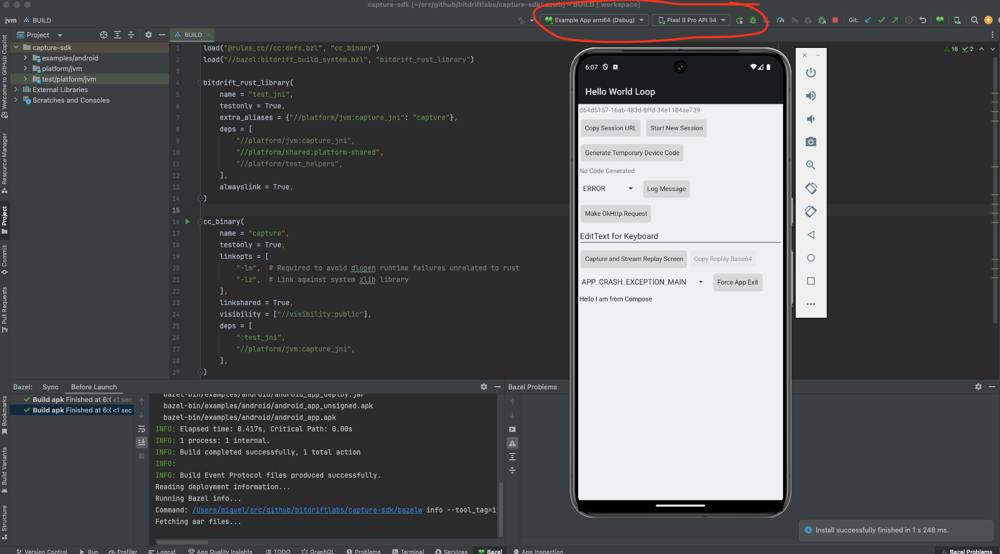

# Local Dev Setup

## Pre-requisites

See the [dependencies section of our main README](/README.md#dependencies) for instructions on installing the pre-requisites.

## iOS

#### Xcode

Xcode 15.4 is used to compile Capture SDK on macOS. Download it from https://developer.apple.com/download/.

*If you install Xcode directly from the App store you will likely not get
the specific version above. Either install it manually or override the
version in your .bazelrc like this:*

```
build --xcode_version=15.4
```

Bazel can also get confused about the status of Xcode installation so if you run into issues with stale version confusion do:

```
./bazelw clean --expunge
./bazelw shutdown
```

If you are using a different version of Xcode/simulator you may also need to adjust the following settings in .bazelrc to match your environment:

```
build --ios_simulator_device="iPhone 15"
build --ios_simulator_version=17.5
```

### Running example app

To create Xcode project iOS Capture SDK:

```bash
./bazelw run :xcodeproj
xed . // opens generated project
```

To run the iOS example app:

```bash
./bazelw run --ios_multi_cpus=x86_64 :ios_app
```

## Android

Local dev setup has only been tested on MacOS running ARM-compatible models.

### 1. Set up JDK

Azul provides JDK releases that are ARM compatible (do not require Rosetta).

Using Homebrew to setup your machine, you can run the following commands to get the correct Zulu JDKs installed.

```console
brew tap mdogan/zulu
brew install --cask zulu-jdk8 zulu-jdk11 zulu-jdk-17
```

To install without Homebrew you can follow these instructions: [https://docs.azul.com/core/zulu-openjdk/install/macos](https://docs.azul.com/core/zulu-openjdk/install/macos)

### 2. Import demo app project into Android Studio

- Install [Android Studio](https://developer.android.com/studio/archive/). The latest verified-to-work version is **Android Studio Jellyfish | 2023.3.1 Patch 1**. When asked to choose between default or custom installation selecting standard works fine.

#### Gradle: Opening Capture SDK project in Android Studio

Setup the environment, open Android Studio.

1. Select `Open...` and select folder `/capture-sdk/platform/jvm`. This should automatically kick off the Gradle sync process.

    - If you get an `NDK not installed` error:

        

    - Go to Tools > SDK Manager > Android SDK > SDK Tools. Make sure that "Show Package Details" is checked and install the NDK version that is required by the project (currently `27.0.12077973`).

        

2. Run/debug the test app either on an emulated or physical device

    - If you receive a `cargo` error due to missing architectures, run:
        ```shell
            rustup update
            rustup target add aarch64-linux-android
            rustup target add x86_64-linux-android
        ```

#### Bazel: Opening Capture SDK project in Android Studio

- Install [bazel plugin](https://plugins.jetbrains.com/plugin/9185-bazel-for-android-studio)

Set up the environment, open Android Studio.

1. Add a new bazel project:


2. Select your repository root path and hit Next:


3. Import the `.bazelproject` file from the root directory and hit Next:


4. You will see a screen similar to the one below, hit Finish and the project should auto-sync:


5. Run the project.



#### Run tests
To run only the JVM tests from command line with bazel use:
`./bazelw test //platform/jvm/...`

- If you get an error trying to run tests from Android Studio, you need to install LLVM
`brew install llvm`

and add it to your path, e.g.

`echo 'export PATH="/opt/homebrew/opt/llvm/bin:$PATH"' >> ~/.zshrc`

#### Entering debugging session

With the project ready, you can now start debugging with Android Studio.

1. From Android Studio select one of the available configurations. Note: If you do not see any configuration available either restart Android Studio or click "Add configuration" and select a desired configuration.
1. Hit the debug icon.
1. Optionally you could create symbolic breakpoints before running by going to the Debugger tab.
